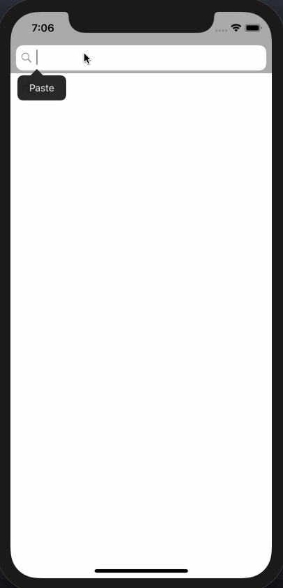
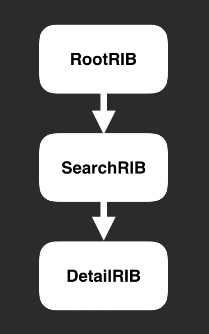

# RIBsSample

========================

[](https://developer.apple.com/iphone/index.action)
[](https://developer.apple.com/swift)
[](http://mit-license.org)
[](https://github.com/dekatotoro/RIBsSample/issues?state=open)


This is a sample that was implemented using RIBs framework in iOS.

[Uber's cross-platform mobile architecture framework](https://github.com/uber/RIBs)

#### It is a simple application that the user search of github.



#### RIBs tree is very simpole.


## Setup
#### Pod setup
```
pod install
```

#### API token setup

You can get personal api token for github and set token to `Config.swift`
```swift
apiToken = "your api token"
```


##### see more information

[GitHub API Tokens](https://github.com/blog/1509-personal-api-tokens)

[GitHub API Reference](https://developer.github.com/v3/)


Warning: you can make up to 30 requests per minute

[search rate limit](https://developer.github.com/v3/search/#rate-limit)


## Requirements
Requires Swift4.2 and Xcode10.1 and iOS 9.0 or later.  


## Contributing
Forks, feedback are welcome.


## Creator
[Yuji Hato](https://github.com/dekatotoro)
[Blog](http://buzzmemo.blogspot.jp/)


## License
RIBsSample is available under the MIT license. See the [LICENSE](./LICENSE) file for more info.
